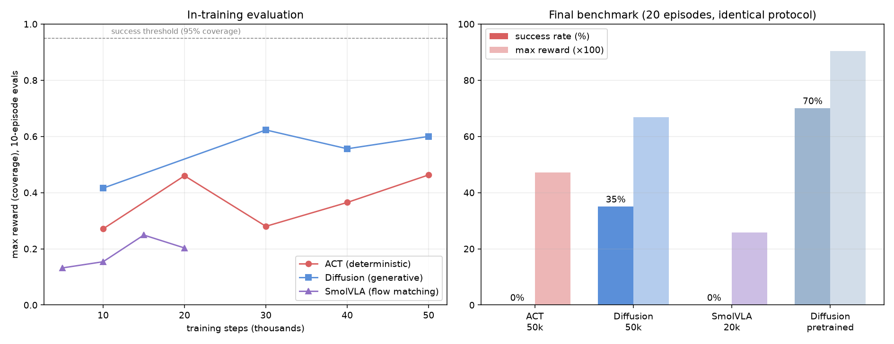
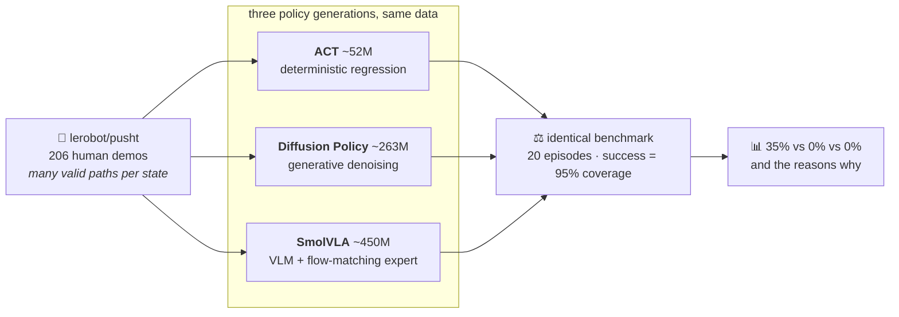
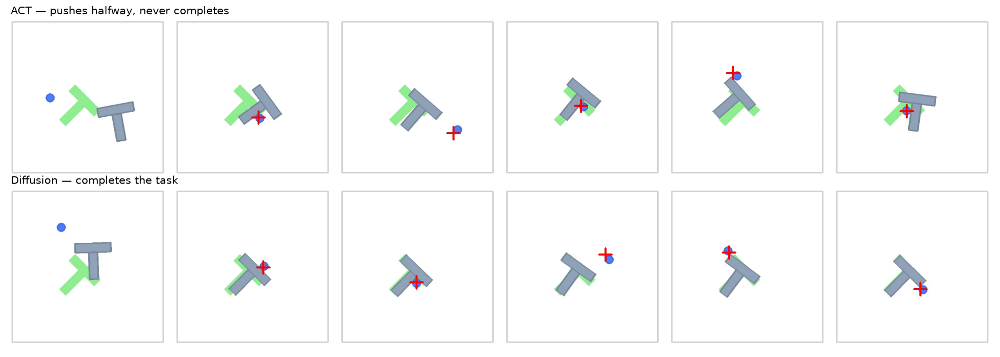

<div align="center">

# VLA on a Budget

**ACT vs Diffusion Policy vs SmolVLA — one task, one 8 GB GPU, one honest table.**

[](https://www.python.org/)
[](https://github.com/huggingface/lerobot)
[](https://pytorch.org/)
[](#)
[](LICENSE)



</div>

## What this is

Robot imitation learning has three generations of policy heads:
deterministic regression (**ACT**), generative diffusion (**Diffusion Policy**), and
foundation-model **VLAs** with flow-matching action experts (**SmolVLA** — the same recipe
as π0, Gemini Robotics, and GR00T). This repo trains all three **locally on a consumer
8 GB laptop GPU**, evaluates them under one identical protocol, and reports what actually
happens — including the negative results.

## The experiment



**Task: PushT** — push a T-shaped block onto a T-shaped target. Looks like a toy; is a
famous multimodality trap: the demos contain many equally-valid push paths, so any policy
that *averages* instead of *committing* fails in a characteristic way.

## Results

| Policy | Params | Budget | Success (20 eps) | Max reward |
|---|---|---|---|---|
| ACT | ~52 M | 50 k × bs 32 | **0 %** | 0.47 |
| **Diffusion Policy** | ~263 M | 50 k × bs 32 | **35 %** | 0.67 |
| SmolVLA | ~450 M | 20 k × bs 8 | **0 %** | 0.26 |
| Diffusion (upstream pretrained, larger budget) | ~263 M | — | 70 % | 0.90 |

<div align="center">

</div>

### Three findings

1. 🎯 **Generative beats deterministic on multimodal demos, 35-to-0.** ACT regresses the
   mean of many valid paths and stalls halfway (top strip, coverage plateau ~0.4).
   Diffusion samples one coherent path and finishes (bottom strip). Identical data and
   budget — only the action head differs.
2. 🧠 **A 450M VLA is not automatically better on a narrow task.** SmolVLA saw ~10× fewer
   samples (batch 8, VRAM-bound), its frozen real-world vision encoder is far out of
   distribution on synthetic 96×96 renders, and its curve was still rising at cutoff.
   Sample-matching would cost ~40 GPU-hours — which *is* the finding: **on consumer
   hardware, specialized policies are compute-optimal for narrow tasks; VLA pretraining
   pays off in the multi-task, language-diverse settings it was built for.**
3. 🔧 **The tooling is younger than the models.** Eight concrete failure modes found and
   fixed (CUDA-torch clobbering, a Windows repo-id path bug, an upstream `--rename_map`
   bug that blocks cross-embodiment fine-tuning…) — full table in
   [docs/NOTES.md](docs/NOTES.md).

## Install

> Any NVIDIA GPU with ~6 GB+ VRAM trains everything here. macOS runs on MPS/CPU — fine
> for evaluation, slow for training.

<details open>
<summary><b>🪟 Windows</b></summary>

```powershell
git clone https://github.com/muhammadmahadazher/vla-on-a-budget && cd vla-on-a-budget
python -m venv .venv; .venv\Scripts\activate
pip install "lerobot[pusht,smolvla]"
pip install torch==2.10.0 torchvision --index-url https://download.pytorch.org/whl/cu126 --force-reinstall
```
*(the last line is mandatory — installing lerobot silently replaces CUDA torch with a CPU build)*
</details>

<details>
<summary><b>🐧 Linux</b></summary>

```bash
git clone https://github.com/muhammadmahadazher/vla-on-a-budget && cd vla-on-a-budget
python3 -m venv .venv && source .venv/bin/activate
pip install "lerobot[pusht,smolvla]"
pip install torch==2.10.0 torchvision --index-url https://download.pytorch.org/whl/cu126 --force-reinstall
```
</details>

<details>
<summary><b>🍎 macOS (MPS/CPU — evaluation OK, training slow)</b></summary>

```bash
git clone https://github.com/muhammadmahadazher/vla-on-a-budget && cd vla-on-a-budget
python3 -m venv .venv && source .venv/bin/activate
pip install "lerobot[pusht,smolvla]"   # default torch build supports MPS
# use --policy.device=mps (or cpu) in the commands below
```
</details>

## Run

| | Command |
|---|---|
| 🏋️ Train ACT (~3.5 h) | `lerobot-train --policy.type=act --policy.device=cuda --policy.push_to_hub=false --dataset.repo_id=lerobot/pusht --env.type=pusht --output_dir=runs/act --steps=50000 --batch_size=32 --eval_freq=10000 --eval.n_episodes=10 --wandb.enable=false` |
| 🏋️ Train Diffusion (~6 h) | same, with `--policy.type=diffusion --output_dir=runs/diffusion` |
| 🏋️ Train SmolVLA (~4.5 h) | same, with `--policy.type=smolvla --output_dir=runs/smolvla --steps=20000 --batch_size=8` |
| ⏸️ Resume any interrupted run | `lerobot-train --config_path=runs/<name>/checkpoints/last/pretrained_model/train_config.json --resume=true` |
| ⚖️ Final benchmark | `lerobot-eval --policy.path=runs/<name>/checkpoints/last/pretrained_model --env.type=pusht --eval.n_episodes=20 --eval.batch_size=10 --policy.device=cuda` |
| 📊 Regenerate figures | `python make_figures.py` |

### Test the setup in 10 minutes (no training)

1. Install (above), then download the reference policy:
   ```python
   python -c "from huggingface_hub import snapshot_download; print(snapshot_download('lerobot/diffusion_pusht'))"
   ```
2. Migrate it to the 0.5 format (one command — see [docs/NOTES.md](docs/NOTES.md) #3), then:
   ```bash
   lerobot-eval --policy.path=<migrated dir> --env.type=pusht --eval.n_episodes=20 --eval.batch_size=10 --policy.device=cuda
   ```
3. Expect **~70 % success** and per-episode MP4s in the output folder — your stack works.

## What each policy's eval videos look like

Every training run saves rollout videos at each checkpoint (`runs/<name>/eval/videos_step_*/`).
Watching ACT try, stall, and orbit the block while diffusion calmly finishes is the whole
lesson of this repo in 20 seconds of MP4.

## Layout

```
README.md            you are here
make_figures.py      regenerates docs/results.png + docs/rollouts.png from run logs
docs/
  results.png        training curves + final 20-episode benchmark
  rollouts.png       frame strips: ACT failure mode vs diffusion success
  NOTES.md           8 failure modes with fixes + eval protocol + run inventory
```

## Limitations & roadmap

- Single task, single seed, 20-episode evals — directional evidence, not a paper
- SmolVLA deserves a sample-matched run (~200 k steps) and an unfrozen-vision ablation
- Next: LIBERO multi-task suites (Linux/WSL), where language conditioning should finally
  earn its parameters — and an SO-101 arm for the real-world version

## References

- Zhao et al., **Learning Fine-Grained Bimanual Manipulation with Low-Cost Hardware (ACT/ALOHA)**, RSS 2023
- Chi et al., **Diffusion Policy: Visuomotor Policy Learning via Action Diffusion**, RSS 2023
- Cadene et al., **SmolVLA: A Vision-Language-Action Model for Affordable and Efficient Robotics**, 2025
- Black et al., **π0: A Vision-Language-Action Flow Model for General Robot Control**, Physical Intelligence, 2024
- **LeRobot** — Hugging Face robotics library · [repo](https://github.com/huggingface/lerobot)

## Companion project

Perception-side sibling: [**OpenVocab-4D**](https://github.com/muhammadmahadazher/openvocab-4D) —
open-vocabulary 4D scene understanding (VGGT + SAM 3) on the same 8 GB laptop.

<div align="center">
<sub>Every number in this README was measured on one RTX 4060 Laptop GPU · MIT License</sub>
</div>
